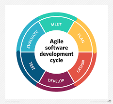

# Methodology
-----
Agile Methodology 
---
Agile software development is based on iterative development, where requirements and solutions evolve through out the software development life cycle. It helps to accomodate incoming changes at any time of the project development.
## Agile software development life cycle
