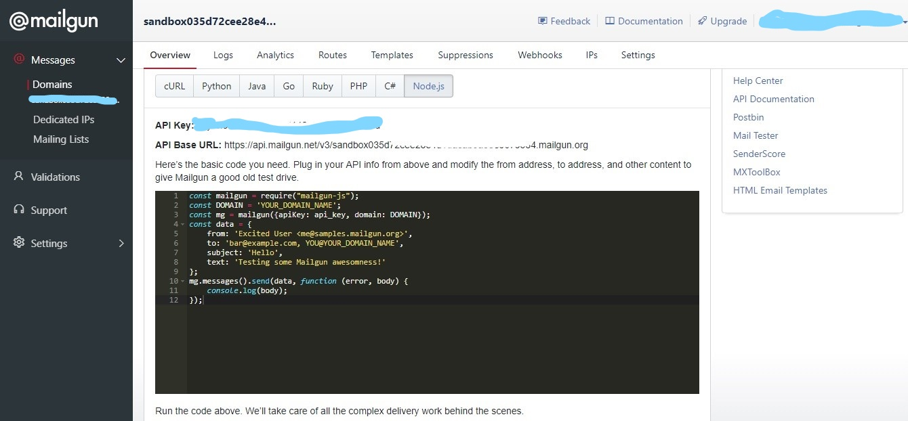
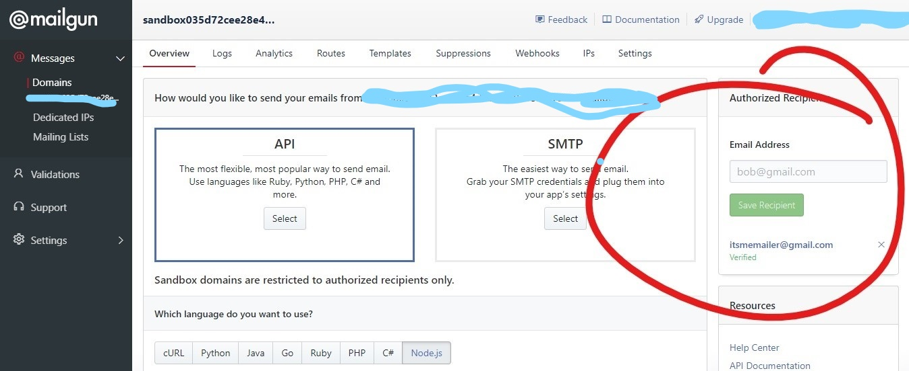
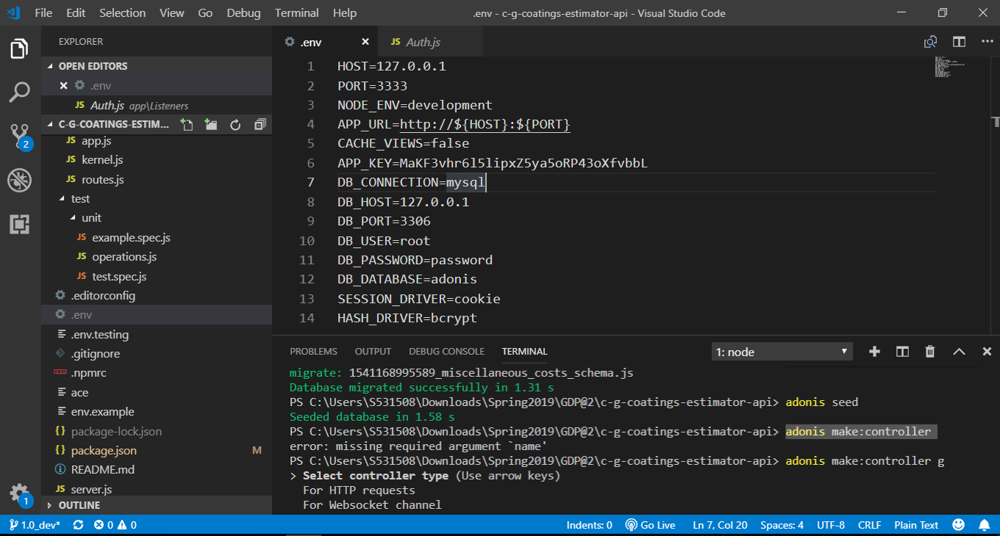

# Tools and Services Used
---
The cost estimating app needs the following:
- **Node.js platform:** It is an open source, cross-platform, JavaScript server-side environment. Node.js runs single-threaded, non-blocking, asynchronously programming, which is very memory efficient. It enables to work both frontend and backend on Java Script.
- **Adonis web framework:** AdonisJs is a Node.js MVC framework that runs on all major operating systems. It offers a stable ecosystem to write server-side web applications. It provides services like BodyParser (Parse HTML request body), Lucid (SQL ORM). It also brings MVC design structure to the project.
- **Edge templating engine:** It enables you to write most of the JS expressions to make pages more dynamic and its main usage is to render the data and template into HTML.
- **Bulma framework:** It is the CSS framework and it is used to create, and JavaScript framework for developing responsive websites.
- **Lodash for JavaScript object iteration and manipulation:** A modern JavaScript utility library delivering modularity, performance.
- **Bodyparser:** Body parser is used to get the data from html form read the data and save them to the data base.
- **Mailgun:** It is an API for node.js to send the mails.
- **MySQL:** It is a cross-platform Structured database program. 
---
## MySQL

1.	 [Download the installer](https://dev.mysql.com/downloads/installer/) for windows or mysql home page and download and install right version for your Operating system. Set the password for your root directory while installing. 
2.	Once MySQL is installed we need workbench, XAMPP etc. to view the database and create one. So download SQL Workbench or XAMPP or SQL pro which you are familiar with. 
3.	Once installed, open MySQL workbench from windows start and create a new scema. 
 
4.	Name the database as adonis or accordingly to the DB name in your environment 
5.	Once database is set there is problem with mysql encryption version as node and mysql are implementing different version type this command and reset the password.
```
ALTER USER 'root'@'localhost' IDENTIFIED WITH mysql_native_password BY 'password'
```
6.	Now open the project and install mysql in node by typing 
```
npm install mysql
```
7.	Now run your migrations in your terminal Adonis migration:run. For existing DB use 
```
Adonis migration:refresh
```
8.	This will create tables the existing database named Adonis. Make sure the database name is adonis and password is password as we reset it to password.
9.	Now You can view all the tables in the workbench.
---
## Mailgun API

1.	Signup for new account [here](https://www.mailgun.com/)
 
2.	Complete the verification by clicking a link which is e-mailed to your email account.
 
3.	You will have to set some security such as Two factor authentication (2FA) and a new password for SMTP.
4.	Click on the domain on the dashboard which starts with “sandbox”.
5.	Click on the API as you wish to use API to send emails.
6.	Select the language you are using. (E.g. Node.js) 
7.	Now the API KEY is generated, COPY the API KEY and DOMAIN.

8.	You should add the authorized recipients and complete verification process.

9.	You can also add a list of your contacts to notify all of them at once.

10.	Now copy the route code of mailgun in to your routes.

11.	Now, put your API key and DOMAIN URL in the code.

12.	Add From & To address in the route code.
13.	That’s it! You should be able to send email now.
---
## Heroku

1.	Create a Heroku account [here](https://www.heroku.com)
2.	Click on create new app button.

3.	Connect to GitHub and make sure the GitHub repository is not a cloned version. 

4.	Click on Authorize Heroku to access GitHub.

5.	Search for the repository and connect.

6.	Click on Enable Automatic Deployment.

7.	Open the app by pressing Open App button on the top-left corner.
---
## Tools used for editing and building the code

- MS Visual Code: It includes support for debugging, embedded Git control, syntax highlighting, intelligent code completion.
- Command Panel: Used for running the commands that makes the application run. It supports the Linux commands.


