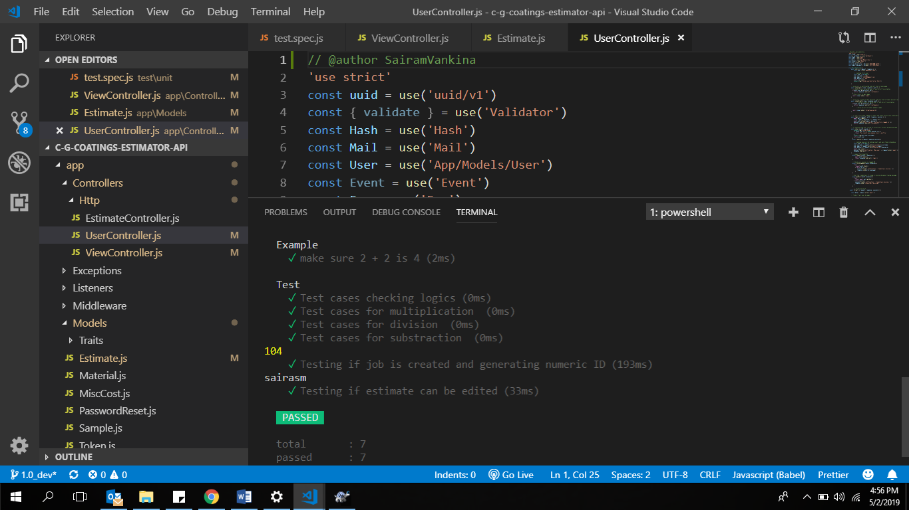
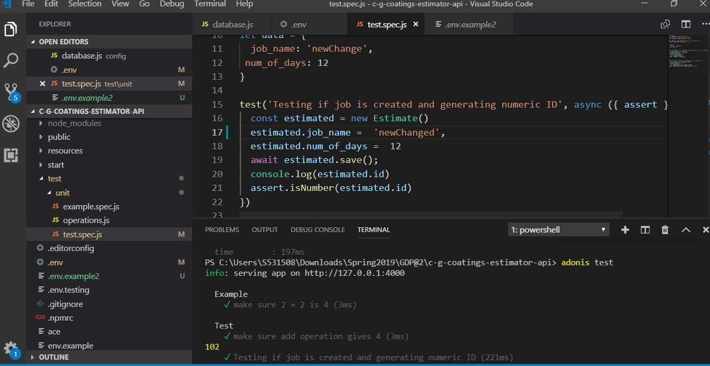
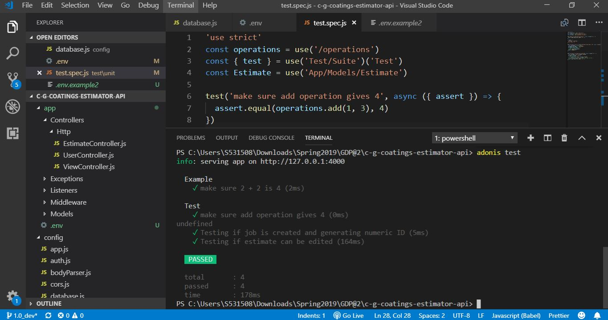

# Results and analysis of test cases
```
'use strict'
const operations = use('/operations')
const { test } = use('Test/Suite')('Test')
const Estimate = use('App/Models/Estimate')

//Testing the add operation
test('Test cases checking logics', async ({ assert }) => {
  assert.equal(operations.add(1, 3), 4)
})
// Testing the multiplication operation
test('Test cases for multiplication ', async ({ assert }) => {
  assert.equal(operations.multiply(1, 3), 3)
})
// Testing the division operation
test('Test cases for division ', async ({ assert }) => {
  assert.equal(operations.division(3, 3), 1)
})
// Testing the substraction operation
test('Test cases for substraction ', async ({ assert }) => {
  assert.equal(operations.substract(4, 3), 1)
})
let data = {
  job_name: 'newChange',
 num_of_days: 12
} 
```
# Testing if job is created and generating numeric ID
```
test('Testing if job is created and generating numeric ID', async ({ assert }) => {
  const estimated = new Estimate()
  //creating new estimate
  estimated.job_name =  'sa',
  estimated.num_of_days =  12
  await estimated.save();
  console.log(estimated.id)
  //cheking if numeric ID is generated
  assert.isNumber(estimated.id)
})
```

# Testing if estimate can be edited
 ```
test('Testing if estimate can be edited', async ({ assert }) => {
  const estimate = await Estimate.find(99)
  // editing name of existing estimate of id 99
  estimate.job_name = 'sairasm';
  await estimate.save();
  const nameAltered = await Estimate.find(99)
  console.log(nameAltered.toJSON().job_name)
  // checking if name is changed
  assert.equal(nameAltered.toJSON().job_name,'sairasm');
})

```
# Results 
Images showing test cases passed
Test cases results:
```
PS C:\Users\S531508\Downloads\Spring2019\GDP@2\c-g-coatings-estimator-api> adonis test
info: serving app on http://127.0.0.1:4000

  Example
    ✓ make sure 2 + 2 is 4 (2ms)

  Test
    ✓ Test cases checking logics (0ms)
    ✓ Test cases for multiplication  (0ms)
    ✓ Test cases for division  (0ms)
    ✓ Test cases for substraction  (0ms)
104
    ✓ Testing if job is created and generating numeric ID (193ms)
sairasm
    ✓ Testing if estimate can be edited (33ms)

   PASSED 

  total       : 7
  passed      : 7
  time        : 236ms
```
Test cases for each user


